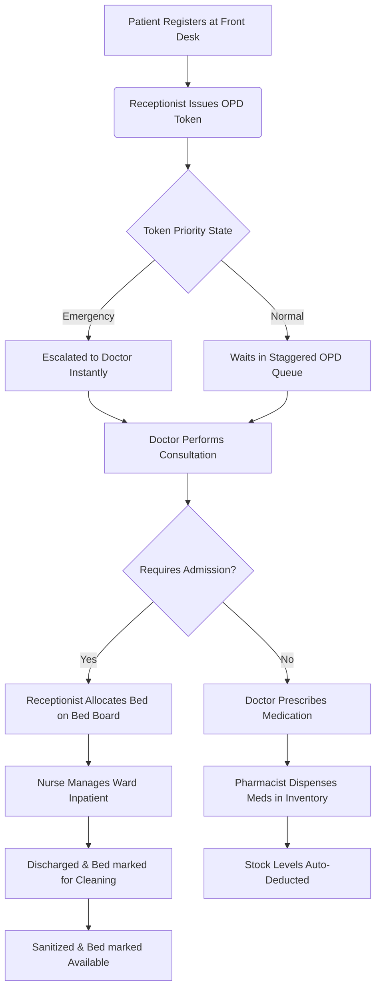

# 🏥 iSHRMS: Integrated Smart Hospital Resource Management System

> **iSHRMS** is a state-of-the-art, high-class clinical operations platform designed to streamline hospital administration, automate OPD consultation queues, sync metropolitan hospital resources, manage real-time ward bed states, and optimize pharmacy logs.

---

## 🛠️ Detailed Technology Stack

### 💻 Frontend (Client Portal)
* **Vite + React.js**: Lightweight framework compiling for physics-based swift UI rendering.
* **TailwindCSS**: Pure utility-first responsive stylesheet layout engine.
* **Framer Motion**: Smooth, organic, trending motion effects and fluid spring transitions.
* **Recharts**: Responsive SVG charts representing complex clinical data streams.
* **React Query (TanStack)**: Automatic cache invalidation and query fetching.
* **Socket.io-client**: Real-time bidirectional telemetry.

### ⚙️ Backend (API Layer)
* **Node.js + Express**: Scalable RESTful API architecture.
* **Prisma ORM**: Modern database layer query modeling.
* **Socket.io**: Real-time websocket broadcasting engine for clinical updates.
* **Web Speech API**: Text-to-Speech (TTS) integration for queue announcements.

### 🗄️ Database (Persistence Layer)
* **PostgreSQL**: Robust, transaction-safe relational database.

---

## 🏥 Core Modules & Main Features

### 🔐 Role Security (RBAC)
Custom logins, session guarding (JWT), and redirection to role-specific dashboards for **Admins, Doctors, Nurses, Receptionists, and Pharmacists**.

### 🏙️ City-Wide Network (City Dashboard)
Connects and compares multiple hospitals in real time to balance patient loads, monitor bed occupancy, and alert cities of critical resource shortages.

### 📋 Real-Time Bed Board
A visual map of ward beds displaying sensor states: **Available** (green), **Occupied** (red), **Cleaning** (purple), or **Maintenance** (yellow). Supports instant bed allocation and ward transfers.

### 🩺 Smart OPD Queue
Prioritizes patient tokens based on clinical severity: **Emergency** (immediate), **High Priority** (Senior Citizen/Pregnancy), or **Normal**.

### 💊 Pharmacy Tracker
Tracks drug stock levels, gives low-stock/expiry warnings, and features a dedicated **Dispense Form** to log transactions and patient history.

### 🔔 Live Notifications
An animated dropdown panel in the top bar showing instant clinical alerts, low stock warnings, and quick-resolve buttons.

### 📊 Interactive Dashboard
Live analytics widgets representing patient footfall trends, OPD severity distributions, department loadings, and weekly available bed census trends.

### 📝 Audit Logs
Records every critical system activity with the active user, transaction type, IP address, and timestamp for complete traceability.

### 📅 Doctor Appointment Scheduler
Real-time appointment booking calendar with automatic double-booking prevention.

### 🔊 Live Waiting Room Caller (TTS)
Automatically announces patient tokens using Text-to-Speech (TTS) when doctors call the next patient.

### 🛡️ Super Admin Global Access
Enables Super Admins to securely manage multiple hospitals through intelligent backend context handling.

---

## 🔄 System Workflow



### Step 1: Patient Intake & Token Generation (Receptionist)
1. **Registration**: Register a new patient or retrieve an existing profile using the UHID.
2. **Generate OPD Token**: Select the Department and Priority (Emergency, Senior Citizen/Pregnancy, or Normal).
3. **Queue Update**: The token is added to the database, and the doctor's queue updates in real-time.

### Step 2: Doctor Consultation (Doctor)
1. **View Queue**: The doctor sees the prioritized patient queue.
2. **Consultation**: Record Vitals, Symptoms, and Diagnosis.
3. **Decision**:
   - **Outpatient**: Generate a prescription and send the patient to the pharmacy.
   - **Inpatient**: Create an admission order for ward allocation.

### Step 3: Bed Allocation (Receptionist)
1. **Open Bed Board**: View available hospital beds.
2. **Bed Status**: Available, Occupied, Cleaning, or Maintenance.
3. **Assign Bed**: Allocate an available bed using the patient's UHID. The bed status updates instantly.

### Step 4: Inpatient Care (Doctors & Nurses)
1. **Monitor Patient**: Update treatment and care records.
2. **Transfer (If Needed)**: Move the patient to another available bed.
3. **Discharge**: Complete the discharge process.
4. **Bed Release**: The bed moves to Cleaning and is later marked Available.

### Step 5: Pharmacy & Inventory (Pharmacist)
1. **Retrieve Prescription**: Search using the patient's UHID.
2. **Dispense Medicine**: Verify stock and dispense medication.
3. **Inventory Update**: Stock is reduced, the transaction is logged, and a Low Stock Alert is generated if required.

---

## 🚀 How to Run Locally

### Prerequisites
- Node.js (v18+)
- PostgreSQL database

### 1. Database Setup
Ensure PostgreSQL is running and update the `.env` database connection string in `ishms-backend/.env`. Run the migrations and seed data:
```bash
cd ishms-backend
npm install
npx prisma migrate dev
node prisma/seed.js
npm run dev
```

### 2. Frontend Setup
```bash
cd ishms-frontend
npm install
npm run dev
```
Open [http://localhost:5174](http://localhost:5174) in your browser.
