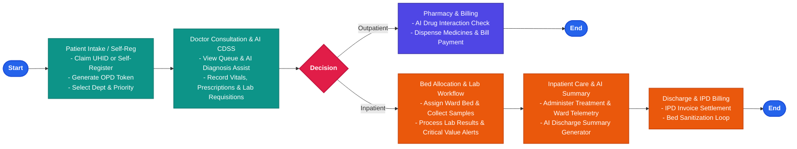

# 🏥 Integrated Smart Hospital Resource Management System (iSHRMS)

## Real-Time Clinical Operations + Socket.io Synchronized Inpatient Telemetry

[](https://i-shrms.vercel.app/)
[](https://react.dev)
[](https://nodejs.org)
[](https://www.postgresql.org)
[](https://ai.google.dev)
[](https://socket.io)
[](https://www.prisma.io)

> A state-of-the-art, high-class clinical operations platform designed to streamline hospital administration, automate OPD consultation queues, sync metropolitan hospital resources, manage real-time ward bed states, optimize pharmacy logs, empower patients via a personal health portal, provide AI clinical decision support via Google Gemini 1.5, and automate billing & lab workflows.

🌐 **Live Deployed Frontend URL**: [https://i-shrms.vercel.app/](https://i-shrms.vercel.app/)

---

## 🛠️ Technology Stack

| Layer | Technology | Function |
| :--- | :--- | :--- |
| **UI & Styles** | React (Vite) + TailwindCSS | High-speed client rendering & glassmorphism styling |
| **Visuals & Motion** | Framer Motion + Recharts (SVG) | Micro-interactions, spring animations & live charts |
| **API & Realtime** | Node.js (Express) + Socket.io | Scalable backend routers & bidirectional event sync |
| **Database & ORM** | PostgreSQL + Prisma ORM | Relational ACID storage & modern migrations |
| **AI Engine** | Google Gemini 1.5 REST API | Pre-triage, CDSS diagnosis, drug interaction matrix & staff NLP |
| **Voice Caller** | Web Speech API | Client-side Text-to-Speech waiting room announcer |

---

## 🏥 Core Modules & Feature Architecture

| Category | Module / Feature | Key Functionality & Capabilities |
| :--- | :--- | :--- |
| **Security & Access** | **🔐 Role Security (RBAC)** | Custom JWT authentication, role guards, and dynamic dashboards for 7 RBAC roles. |
| | **🛡️ Super Admin Global** | Centralized multi-hospital cluster management with context-aware analytics. |
| **Patient Ecosystem** | **👤 Patient Portal** | Hybrid 3-factor UHID claim / self-reg, live queue tracker, prescr. PDF, vitals charts & document vault. |
| | **📅 Doctor Scheduler** | Double-booking prevention calendar with automated slot management. |
| **AI Intelligence** | **🤖 AI Intelligence Hub** | Gemini 1.5 powered pre-triage, CDSS doctor co-pilot (ICD-10), drug interactions & staff NLP chatbot. |
| **Clinical Ops** | **🩺 Smart OPD Queue** | Severity triage (Emergency, Priority, Normal) & live Text-to-Speech (TTS) token announcer. |
| | **📋 Real-Time Bed Board** | Interactive sensor-mapped ward beds (Available, Occupied, Cleaning, Maintenance). |
| | **🧪 Lab & Diagnostics** | Order lifecycle (Requisition $\rightarrow$ Sample $\rightarrow$ Results) with real-time Socket.io STAT/critical alerts. |
| **Finance & Pharmacy**| **💰 Billing & Invoicing** | Itemized OPD/IPD GST invoices ($N\text{ Days} \times \text{Bed Rate}$), multi-method payment & revenue stats. |
| | **💊 Pharmacy Tracker** | Stock inventory management, low-stock/expiry alerts, and UHID prescription dispensing. |
| **Analytics & Alerts**| **🏙️ City-Wide Network** | Real-time multi-hospital resource comparison, load balancing, and city shortage alerts. |
| | **📊 Live Analytics** | Footfall charts, OPD severity breakdown, department load, and bed census telemetry. |
| | **🔔 Clinical Alerts** | Instant topbar notification panel with one-click quick-resolve actions. |
| | **📝 Audit Trail** | Immutable log of user actions, transactions, IP addresses, and timestamps for governance. |

---

## 🔑 Role-Based Access Control (RBAC) Matrix

| Role | Dashboard View | Key Capabilities |
| :--- | :--- | :--- |
| **Super Admin** | Multi-Hospital Global View | Manage multiple hospital clusters, compare occupancy/shortages, view audit logs |
| **Admin** | Hospital Management | Configure departments, beds, view analytics, manage personnel, handle inventory |
| **Doctor** | Consultation Dashboard | View OPD queues, update patient vitals, write prescriptions, use AI CDSS, order lab tests |
| **Nurse** | Ward Bed Board | Monitor bed/sensor status, assign patients to beds, request transfers, discharge inpatients |
| **Receptionist**| Patient Intake & Billing | Register patients, generate priority OPD tokens, allocate beds, generate bills & collect payments |
| **Pharmacist** | Inventory & Dispensation | Dispense medicine by UHID, manage stock transactions, run AI Drug Interaction Checker |
| **Patient** | Personal Health Portal | View OPD queue position, book appointments, log vitals, track prescriptions, view lab results |

---

## 🔄 System Architecture & Workflow

```mermaid
graph LR
    classDef startEnd fill:#2563eb,stroke:#1d4ed8,stroke-width:2px,color:#ffffff,font-weight:bold;
    classDef step fill:#0d9488,stroke:#0f766e,stroke-width:1.5px,color:#ffffff;
    classDef decision fill:#e11d48,stroke:#be123c,stroke-width:2px,color:#ffffff,font-weight:bold;
    classDef inpatient fill:#ea580c,stroke:#c2410c,stroke-width:1.5px,color:#ffffff;
    classDef outpatient fill:#4f46e5,stroke:#3730a3,stroke-width:1.5px,color:#ffffff;

    Start([Start]):::startEnd --> Reg[Patient Intake / Self-Reg<br/>- Claim UHID or Self-Register<br/>- Generate OPD Token<br/>- Select Dept & Priority]:::step
    Reg --> Consult[Doctor Consultation & AI CDSS<br/>- View Queue & AI Diagnosis Assist<br/>- Record Vitals, Prescriptions & Lab Requisitions]:::step
    Consult --> Dec{Decision}:::decision

    Dec -->|Outpatient| Pharm[Pharmacy & Billing<br/>- AI Drug Interaction Check<br/>- Dispense Medicines & Bill Payment]:::outpatient
    Pharm --> EndOut([End]):::startEnd

    Dec -->|Inpatient| BedAlloc[Bed Allocation & Lab Workflow<br/>- Assign Ward Bed & Collect Samples<br/>- Process Lab Results & Critical Value Alerts]:::inpatient
    BedAlloc --> Care[Inpatient Care & AI Summary<br/>- Administer Treatment & Ward Telemetry<br/>- AI Discharge Summary Generator]:::inpatient
    Care --> Discharge[Discharge & IPD Billing<br/>- IPD Invoice Settlement<br/>- Bed Sanitization Loop]:::inpatient
    Discharge --> EndIn([End]):::startEnd
```

---

## 📂 Repository Directory Structure

```text
iSHRMS/
├── assets/                    # Static assets
├── docker-compose.yml         # Multi-container Docker orchestration config
├── render.yaml                # Render Web Service deployment configuration
├── vercel.json                # Vercel Single-Page Application deployment config
├── README.md                  # Project documentation
├── backend/                   # Express.js REST & Real-time Socket.io server
│   ├── prisma/                # Prisma ORM schema, migrations, and seed scripts
│   ├── seed_rich_demo_data.js # Comprehensive multi-module demo seeder
│   ├── verify_workflow.js     # E2E hospital workflow verification suite
│   └── src/                   # Backend application source code
│       ├── controllers/       # Handlers (Auth, Patients, OPD, Beds, Billing, Lab, AI)
│       ├── middlewares/       # Request interceptors (JWT auth, RBAC validation)
│       ├── routes/            # REST API endpoint route definitions
│       └── services/          # External services (Google Gemini 1.5 REST service)
└── frontend/                  # React (Vite) client web application
    ├── public/                # Static public assets
    └── src/                   # Client application source code
        ├── components/        # Reusable UI widgets, Patient Layout, & Topbar
        ├── context/           # React context providers (Auth context, Socket state)
        └── pages/             # Staff & Patient Portal views (AIAssistant, Billing, LabDiagnostics, Patient Portal pages)
```

---

## 🚀 How to Run & Deploy

### 🌐 Live Production Deployment
- **Live Frontend**: [https://i-shrms.vercel.app/](https://i-shrms.vercel.app/)
- **Backend API**: Hosted on Render Web Service
- **Database**: Cloud PostgreSQL on Neon.tech

---

---

### Local Manual Setup

#### Prerequisites
- Node.js (v18+)
- PostgreSQL database

#### 1. Database & Backend Setup
```bash
cd backend
npm install
npx prisma db push
node seed_rich_demo_data.js
npm run dev
```

#### 2. Frontend Setup
```bash
cd frontend
npm install
npm run dev
```
Open [http://localhost:5174](http://localhost:5174) in your browser.
